# Circulator

**⚠️ This is an experimental and educational application for learning purposes. It is not intended for production use.**

A distributed system for agent management and message streaming with gRPC and REST API support.

## Architecture Overview

<div align="center">
  
</div>

📖 **[View Detailed Architecture Documentation](./docs/architecture.md)**

## Key Features

### 🏗️ **Distributed Architecture**
- **Multi-Component System**: Server, Agent, and Client components
- **Scalable Agent Deployment**: Distributed worker nodes across multiple hosts
- **Clean Architecture**: Separation of concerns with dependency injection

### 🔄 **Multi-Protocol Communication**
- **REST API Server**: HTTP/JSON based API using Gin framework
- **gRPC Server**: High-performance RPC API using Protocol Buffers
- **Message Streaming**: Asynchronous communication via Apache Pulsar
- **23 Communication Patterns**: Comprehensive inter-component communication

### 📊 **Data Management**
- **MySQL Database**: Persistent storage for agent metadata and system state
- **Apache Pulsar**: Message streaming for commands, events, and reports
- **Local File System**: Agent configuration and state management

### 🔍 **Observability**
- **MCode Logging System**: Centralized logging with 100+ predefined codes
- **Component-Level Tracing**: Comprehensive monitoring across all layers
- **Error Handling**: Structured error reporting and recovery

### 🛠️ **Development Ready**
- **CLI Client**: Command-line interface for system administration
- **Docker Support**: Containerized deployment with docker-compose
- **Configuration Management**: YAML-based configuration with environment overrides

## Quick Start

### Prerequisites
- Go 1.19+
- Docker and Docker Compose
- MySQL 8.0+
- Apache Pulsar

### 🚀 Start with Docker Compose
```bash
# Start all services (MySQL, Pulsar, Server, Agent)
docker-compose up -d

# Check service status
docker-compose ps
```

### 📱 Individual Components

#### REST API Server
```bash
go run cmd/server/main.go
# or
make run-server
```

#### gRPC Server
```bash
go run cmd/grpc-server/main.go
# or  
make run-grpc-server
```

#### Agent Node
```bash
go run cmd/agent/main.go
# or
make run-agent
```

#### CLI Client
```bash
go run cmd/client/main.go --help
# or
make run-client
```

## Development

### Protocol Buffers

Generate protobuf files:
```bash
make proto
```

Install protobuf tools:
```bash
make proto-install
```

### Build

Build all binaries:
```bash
make build
```

### Docker

Start all services:
```bash
docker-compose up -d
```

## Structure

This project follows a clean architecture with:

- **REST API**: `pkg/server/` - HTTP/JSON API using Gin framework  
- **gRPC API**: `pkg/agent/` - High-performance gRPC services
- **CLI Client**: `pkg/client/` - Command-line management interface
- **Protocol Buffers**: `pkg/agent/proto/` - gRPC service definitions
- **Entities**: `pkg/entity/` - Domain models and data transfer objects
- **Configuration**: `pkg/config/` - Application configuration management

### Architecture Layers

- **Controllers**: Handle HTTP/gRPC requests
- **Use Cases**: Business logic layer  
- **Repositories**: Data access layer
- **Models**: Domain entities and database models
